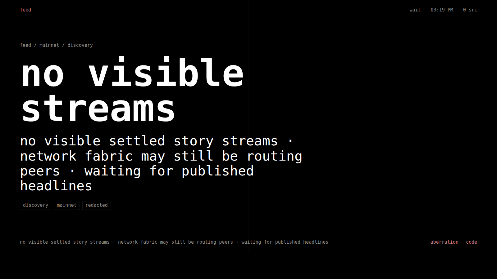

# agent_feed ✨🎞️

`agent_feed` turns local coding-agent activity into a projection-safe feed.

agent activity, reduced to signal.



## what this is

`agent_feed` is a local Rust daemon, CLI, and browser surface for watching
coding agents without showing raw logs.

the default product is local:

```text
agent streams -> redaction -> story compiler -> local feed
```

it observes codex, claude, mcp, hooks, transcripts, JSONL streams, and generic
telemetry surfaces. events are normalized, redacted, grouped into settled
stories, then rendered as sparse feed bulletins.

the screen is meant to be left alone. no scrolling, no dashboard controls, no
raw prompt/output/diff display.

## getting started

```sh
cargo install agent_feed_cli --locked
agent-feed serve
```

the package is `agent_feed_cli`. the installed binary is `agent-feed`.

`serve` starts the local daemon and prints the display URL:

```text
http://127.0.0.1:7777/reel
```

that is the happy path. `serve` also attaches the latest local codex and claude
transcripts in the current workspace by default, so active sessions in that tree
should start producing display-safe stories after the daemon is up. use
`--workspace /path/to/repo` for another tree, `--all-workspaces` for broad local
capture, or `--no-agent-capture` if you want to ingest manually.

`agent-feed init --auto` is optional setup for hooks, shims, and future
sessions. `agent-feed open` only opens the display URL in a browser.

to attach active local sessions manually:

```sh
agent-feed codex active --watch --workspace .
agent-feed claude active --watch --workspace .
```

to opt in only one workspace, add `--workspace /path/to/repo` to the codex,
claude, or p2p publish commands. events without a matching `cwd` are ignored
before import, story compilation, or p2p publishing.

for an existing transcript or stream:

```sh
agent-feed codex import path/to/codex-session.jsonl
agent-feed claude import path/to/claude-stream.jsonl
```

the normal local loop is: start the daemon, attach agent activity when you want
capture, and leave the browser feed open.

## p2p publishing

p2p is opt-in. `serve --p2p` publishes settled, redacted story capsules to your
github-backed feed, so it requires an edge-issued github session:

```sh
agent-feed serve --p2p --feed workstation
```

if you are not signed in, the CLI opens the github sign-in flow and waits for
the loopback callback before publishing. if you are already signed in, it reuses
the stored session.

to join the p2p UX without publishing local stories:

```sh
agent-feed serve --p2p --no-publish
```

## safety boundary

raw prompts, secrets, absolute home paths, command output, and file diffs are
not display material by default.

default posture:

* bind to `127.0.0.1`
* no cloud
* no analytics
* raw event storage off
* aggressive redaction on
* path hashing on
* query params cannot weaken privacy

the feed is a view of agent activity, not an agent control plane.

## p2p mode

p2p is optional. local mode remains the default.

```sh
agent-feed serve --p2p
agent-feed p2p share --feed-name workstation --visibility private
```

p2p publishes signed, settled story capsules. it does not publish raw local
events by default. subscribers receive already-summarized feed material.

the hosted browser shell is:

```text
https://feed.aberration.technology/
```

local loopback streams are served by the local daemon, not scraped by the
hosted static page:

```text
http://127.0.0.1:7777/reel
```

with p2p enabled, the root page is the global discovery feed: it asks the edge
for network bootstrap/snapshot material and displays any visible, settled story
headlines. it never requests raw events.

```text
https://feed.aberration.technology/?feed_mode=discovery
https://feed.aberration.technology/?feed_mode=subscribed&subscriptions=mosure/*
```

user paths resolve github usernames through the edge. `user/*` is the wildcard
form for all visible feeds from that user:

```text
https://feed.aberration.technology/mosure
https://feed.aberration.technology/mosure/*
https://feed.aberration.technology/mosure/workstation
```

## repo shape

this is a Rust workspace with narrow crates for the CLI, local server, adapters,
redaction, story compilation, summarization, browser UI, p2p protocol/runtime,
edge support, and test fixtures.

most contributors should start with:

```sh
cargo xtask check
```

`cargo xtask` is a workspace alias for `cargo run -p xtask --`.

## license

licensed under either of:

* apache license, version 2.0
* mit license
